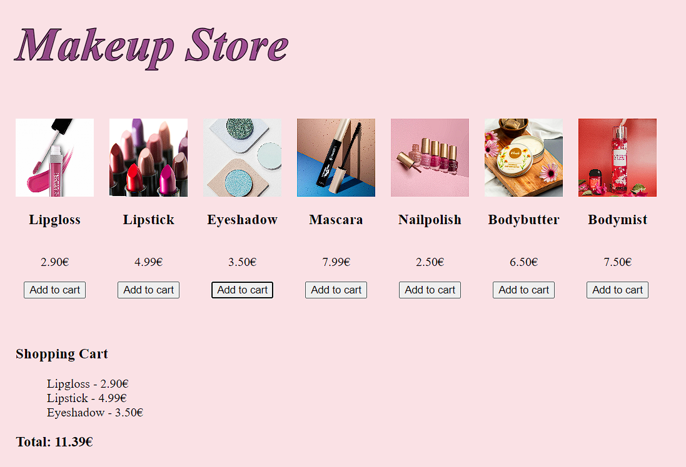

# Makeup Store / Meikkikauppa

## Overview / Yleiskuvaus

### English

This project is a small practice assignment where I built a simple web application that displays a selection of cosmetic products and allows the user to add items to a shopping cart. Each product includes an image, name, and price. When the user clicks Add to cart, the item is added to the cart list and the total price updates automatically.

### Features

- Product list with images, names, and prices

- Individual Add to cart buttons

- Shopping cart that displays added items

- Automatically updating total price

### Technologies Used

- HTML

- CSS

- JavaScript 

### AI Assistance
I used Copilot as a learning aid during this practice project. In my studies we have not yet covered handling multiple buttons or retrieving product information from the DOM, so I used Copilot to help me understand these techniques.

### How to Run

- Download or clone the project folder

- Open index.html in a browser

- Add products to the cart and watch the total update

### Suomi

Tämä projekti on harjoitustyö, jossa toteutin pienen verkkosovelluksen kosmetiikkatuotteiden esittämiseen ja ostoskoriin lisäämiseen. Jokaisella tuotteella on kuva, nimi ja hinta. Kun käyttäjä painaa Add to cart, tuote lisätään ostoskorilistaan ja kokonaishinta päivittyy automaattisesti.

### Ominaisuudet

- Tuotelista kuvin, nimillä ja hinnoilla

- Jokaiselle tuotteelle oma Add to cart ‑nappi

- Ostoskori, joka näyttää lisätyt tuotteet

- Automaattisesti päivittyvä kokonaishinta

### Käytetyt teknologiat

- HTML

- CSS

- JavaScript

### AI‑apu

Käytin Copilotia oppimisen tukena tämän harjoitustyön aikana. Opinnoissa emme ole vielä käsitelleet useiden nappien käsittelyä tai tuotetietojen hakemista DOM‑rakenteesta, joten käytin Copilotia näiden tekniikoiden ymmärtämiseen.

### Projektin suorittaminen

- Lataa tai kloonaa projektikansio

- Avaa index.html selaimessa

- Lisää tuotteita ostoskoriin ja seuraa kokonaishinnan päivittymistä

## Makeup Store - UI Preview

